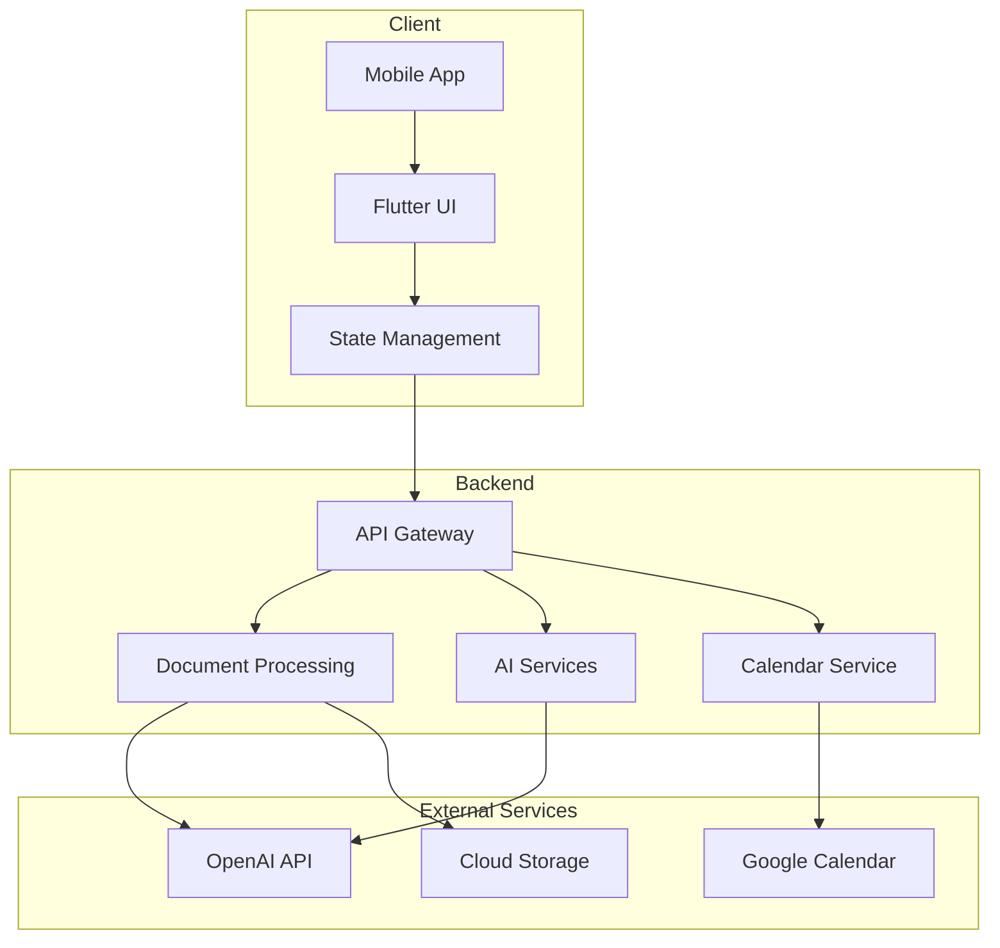
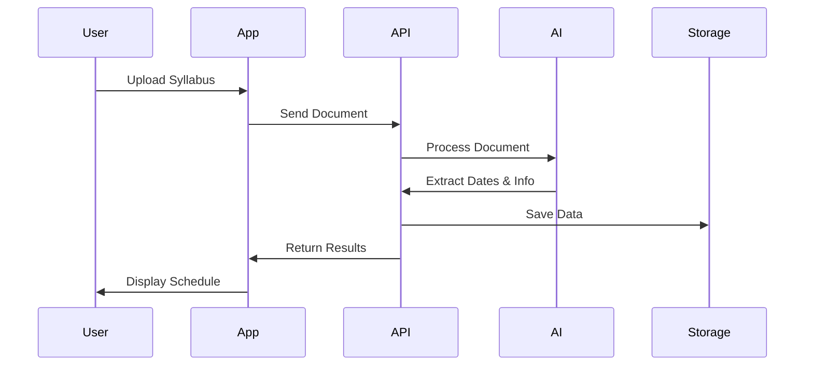
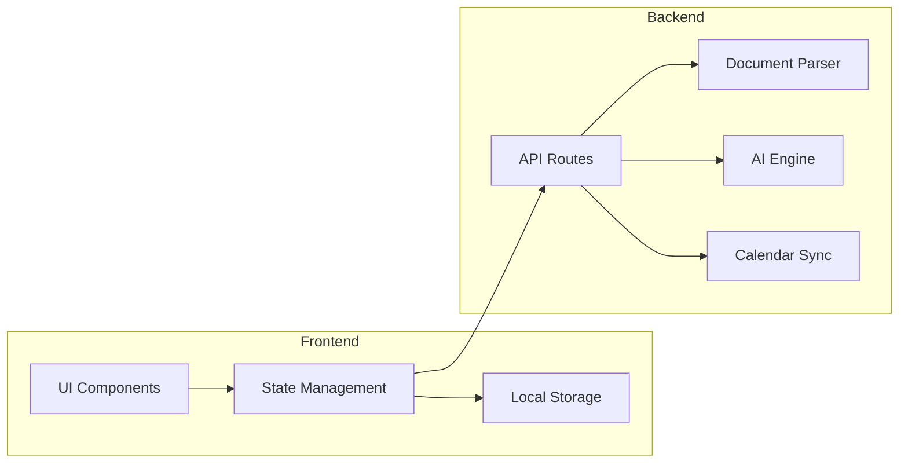

# 📚 StudyWise — Smart Study Scheduler & Assistant

**StudyWise** is an AI-powered mobile app designed to streamline academic organization and enhance learning for students. Upload your syllabus, extract all important academic dates automatically, and turn lecture slides into smart study notes and personalized quizzes—all from your phone or tablet.


## 💡 Why StudyWise
As students, we've all experienced the frustration of combing through syllabi to extract important dates and manually creating notes from lectures. StudyWise aims to eliminate these tedious tasks using AI, so students can focus more on learning and less on logistics.

---

## 🚀 Features

### 📆 Syllabus Date Extractor
- Upload your course syllabus (PDF, DOCX, TXT).
- Automatically detects and extracts:
  - Assignment due dates  
  - Project milestones  
  - Quiz and midterm schedules  
  - Final exam information  
- Sync events to your device's calendar or Google Calendar (via integration or `.ics` export).

### 📝 AI-Powered Study Notes Generator
- Upload lecture slides (PDF or PowerPoint).
- Automatically generates:
  - Clean, readable study notes  
  - Organized by topic or slide section  
  - Optimized for mobile reading

### 🗒️ Intelligent Quiz Creator
- Generates practice quizzes from lecture material
- Multiple-choice, true/false, and short-answer formats
- Provides instant feedback and scoring
- Helps reinforce memory and key concepts

---

## 📱 Built with Flutter

**StudyWise** is built using [Flutter](https://flutter.dev), enabling seamless performance on:
- Android  
- iOS  
- Web *(planned)*  
- Desktop *(optional for future versions)*

---

## 🛠️ Tech Stack

- **Frontend & App Framework:** Flutter  
- **Backend (API):** Python (FastAPI or Flask)?? 
- **AI/NLP:** OpenAI API / Hugging Face Transformers / spaCy??  
- **Document Parsing:** PyMuPDF / pdfplumber / Tesseract (OCR)??  
- **Cloud Storage & Auth:** Firebase / AWS S3??  
- **Calendar Integration:** Google Calendar API / iCalendar (.ics) format??  

---

## 🏗️ System Architecture

### High-Level Architecture


### Data Flow


### Component Interaction


---

## 📦 Getting Started (Development)

```bash
# Clone the repo
git clone https://github.com/FrankObedi/studywise.git
cd studywise

# Get Flutter dependencies
flutter pub get

# Run the app on a device or emulator
flutter run
